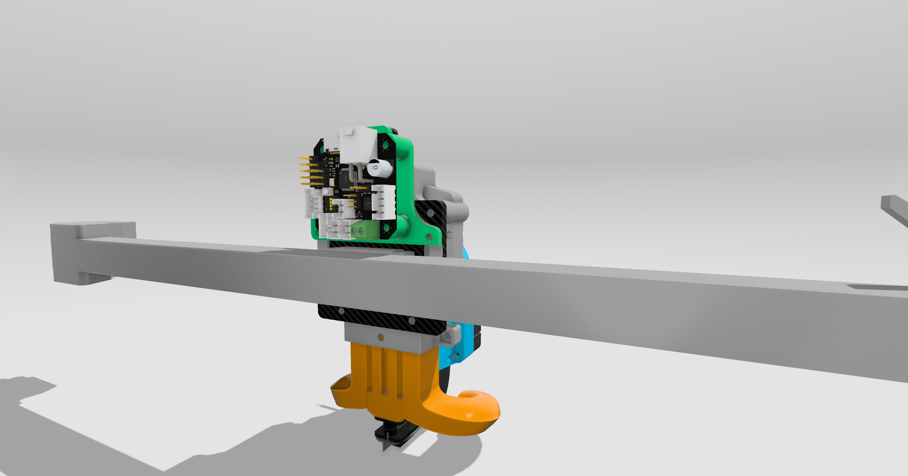

# Bigtreetech EBB42 Mount

This mod enables the secure mounting of the Bigtreetech EBB42 to the back of a carbon fiber extruder mount, enhancing the functionality of your 3D printer. It is a modified mount for the x microswitch. You may need a different x/y finger.

## Parts Required

Bigtreetech EBB42
4x M3 heat inserts
Assorted M3 bolts (appropriate length for your setup)

## Assembly Instructions

# Prepare the Mount:

Insert the 4 M3 heat inserts into the designated slots on the EBB42 mount. Ensure they are properly seated.
Install the X microswitch. Ensure it is securely attached and properly aligned for correct functioning.

# Attach the EBB42 Mount

Attatch the mount to the back plate of the extruder. Depending on what setup you are using you will need different length bolts to match.

# Install the EBB42

Position the Bigtreetech EBB42 on the back of the new mount, aligning the mounting holes with the heat inserts over the installed X microswitch.
Ensure the screws are tightened appropriately to avoid damaging the components.

