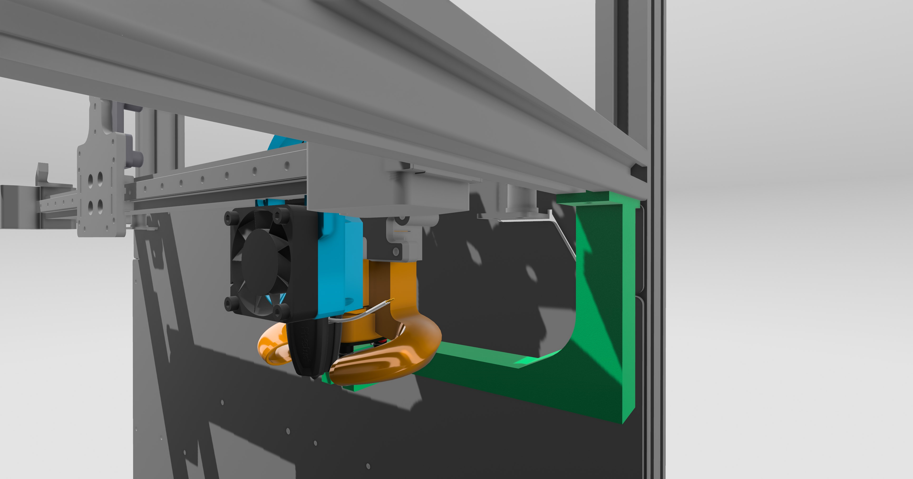

Breezer Nozzle Mod for Euclid Probe
This mod adapts the Breezer Nozzle to allow the use of the Euclid probe, ensuring the probe is centered on the nozzle. It includes a two-piece probe dock that may require some modification to accommodate height changes. The dock requires 2 M3 heat inserts.

Parts Required
Breezer Nozzle
Euclid Probe
Two-piece probe dock
2x M3 heat inserts
1x T-nut
3x M3 Cap Screws

Assembly Instructions

Prepare the Dock:
Insert the 2 M3 heat inserts into the Upper Mount. Ensure they are properly seated.

Attach the Probe:
Attach the Euclid probe to the Breezer Nozzle.

Attach the Dock:
Mount the dock to the printer frame ensuring it aligns correctly for easy docking and undocking of the Euclid probe.

    Depending on your printer setup, you may need to make some adjustments to the height of the probe dock. Ensure the probe can dock and undock smoothly without interference. Test the docking mechanism and adjust as necessary to achieve a perfect fit.

    You can modify the STEP file, use shims, or heat and bend as needed.

Calibration:
Once installed, perform a calibration sequence to ensure the probe is functioning correctly and providing accurate measurements.

    A euclid.cfg file is provided for reference. Ensure all docking positions, etc., are compatible with your machine and positioning of the dock.

